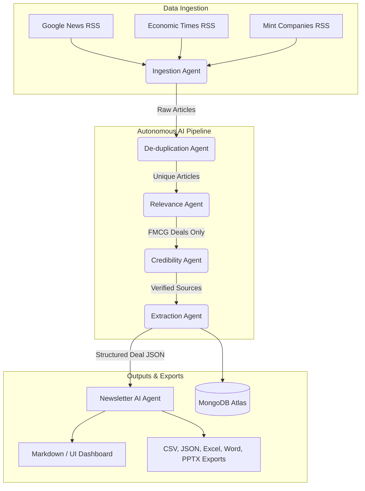

# Autonomous FMCG Intelligence Agent

An autonomous AI agent pipeline that aggregates, deduplicates, and analyzes real-time news to generate a concise, executive-level FMCG (Fast-Moving Consumer Goods) M&A and investment newsletter.

---

## 🏗 Architecture Diagram



---

## 🧠 Pipeline & Agentic Thinking

The system follows a strict, sequential pipeline designed for minimal hallucinations and maximum data integrity:

### 1. Ingestion (Sourcing)
The agent continuously polls 3 distinct RSS feeds (Google News, ET FMCG, LiveMint) to guarantee a diverse and real-time capture of the Indian FMCG landscape. It uses `newspaper3k` to download the full HTML content of the articles.

### 2. De-duplication Logic (Practical Handling)
> **Design Decision**: While semantic embeddings were considered, **RapidFuzz** (Fuzzy String Matching) was chosen for deduplication. 
- **Why?** News articles about opposing deals (e.g., *"Nestlé BUYS brand"* vs *"Nestlé SELLS brand"*) can have nearly identical semantic embeddings, leading to false positives. Fuzzy string matching on the title and domain URL is significantly faster, costs $0 in API credits, runs locally, and provides higher precision for this specific M&A news use case.

### 3. Relevance & Credibility Checks
- **Relevance**: A lightweight LLM call evaluates the full text of the article to ensure it represents a genuine financial transaction (M&A, Funding, Strategic Investment, JV) within the FMCG sector. It actively filters out product launches, stock market fluctuations, and irrelevant industries.
- **Credibility**: The system checks the source domain against known reputable publishers. Articles lacking sufficient verifiable information are scored down and removed from the pipeline.

### 4. Extraction & Newsletter Generation
- The remaining verified articles are processed by the LLM (Perplexity Sonar-Pro) to extract structured JSON data (Target Company, Buyer, Deal Type, Value).
- Finally, the Newsletter Agent formats this structured JSON into a 3-minute executive brief, categorizing deals into Top Deals, Funding Activity, and Market Trends.

---

## 💻 Tech Stack
- **Backend API**: Python, FastAPI
- **Frontend UI**: Next.js (React), TailwindCSS, Recharts
- **Database**: MongoDB Atlas (Stores historical pipeline runs, extracted deals, and generated newsletters)
- **AI / LLM**: Perplexity API (`sonar-pro` model for deep reasoning)
- **Data Processing**: Pandas, RapidFuzz, python-docx, python-pptx

---

## 🚀 How to Run Locally

### Prerequisites
- Python 3.9+
- Node.js 18+
- `.env` file with `PERPLEXITY_API_KEY` and `MONGO_URI`

### One-Click Start
To start both the FastAPI backend and Next.js frontend simultaneously, simply run the bash script:
```bash
chmod +x start.sh
./start.sh
```

- **Frontend Dashboard**: `http://localhost:3000`
- **Backend API Docs**: `http://localhost:8000/docs`

---

## 📂 Deliverables & Exports
When the pipeline completes a run, it automatically generates the required deliverables in the `/exports` folder:
- `newsletter.csv` & `newsletter.xlsx` (Raw tabular deal data)
- `newsletter.json` (Structured JSON array)
- `newsletter.docx` (Formatted Word Document for business users)
- `newsletter.pptx` (PowerPoint deck ready for presentation)

These can also be directly downloaded from the **Reports & Exports** tab in the UI dashboard.
